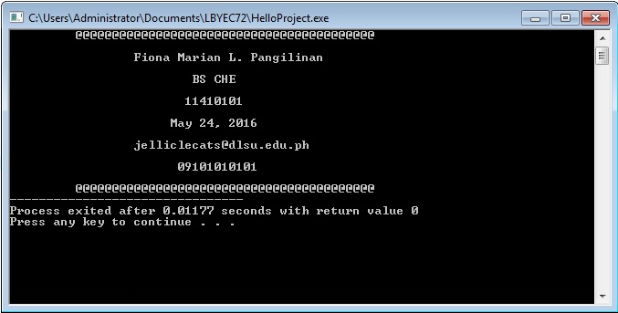
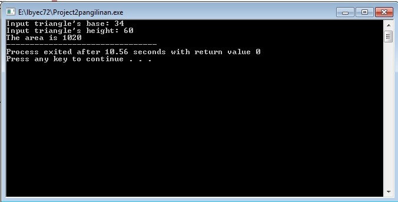
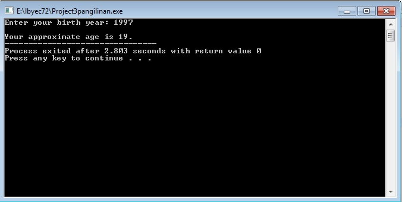
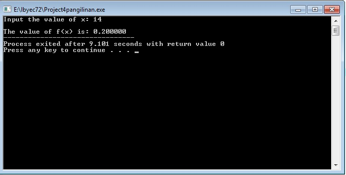

# HelloFromFionaPangilinan
```
#include <stdio.h>
#include <stdlib.h>


int main(){
	printf("\t @@@@@@@@@@@@@@@@@@@@@@@@@@@@@@@@@@@@@@@@@");
	printf("\n\n \t \t Fiona Marian L. Pangilinan");
	printf("\n\n \t \t \t BS CHE");
	printf("\n\n \t \t        11410101");
	printf("\n\n \t \t      May 24, 2016");
	printf("\n\n \t \t jelliclecats@dlsu.edu.ph");
	printf("\n\n \t \t       09101010101");
	printf("\n\n\t @@@@@@@@@@@@@@@@@@@@@@@@@@@@@@@@@@@@@@@@@");

	return 0;
	
}
```


```
#include <stdio.h>
#include <stdlib.h>


int main() {
	int base, height, area;
	printf("Input triangle's base: ");
	scanf("%d", &base);
	printf("Input triangle's height: ");
	scanf("%d", &height);
	
	area = ((base*height)/2);
	printf("The area is %d", area);
	
	return 0;
}
```


```
#include <stdio.h>
#include <stdlib.h>


int main() {
	
	int by, age;
	printf("Enter your birth year: ");
	scanf("%d", &by);
	age = 2016 - by;
	printf("\n");
	printf("Your approximate age is %d.", age);
	return 0;
}
```


```
#include <stdio.h>
#include <stdlib.h>


int main() {
	
	float x, fx;
	printf("Input the value of x: ");
	scanf("%f", &x);
	
	fx = (x/70);
	printf("\n");
	printf("The value of f(x) is: %f", fx);
	return 0;
}
```

